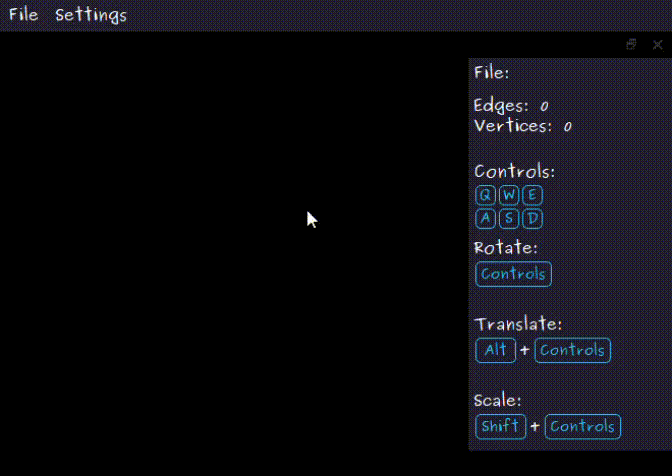
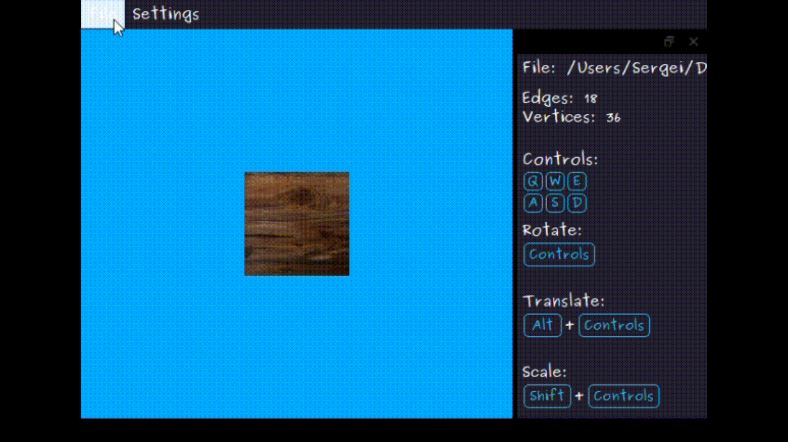
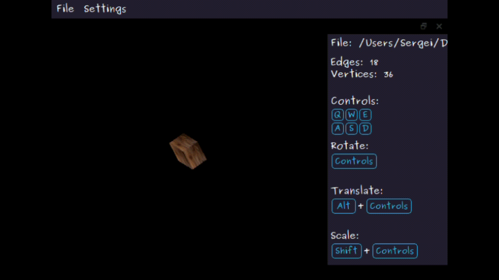
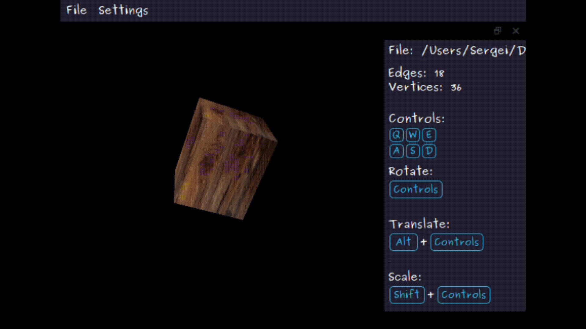

### Программа для просмотра 3D-моделей

**Программа имеет фичи:**

- Выбор файла модели
- Смена фона
- Выбор параллельной или центральной проекции
- Поворот, масштабирование и смещение модели

#### Выбор файла модели

#### Смена фона

#### Выбор параллельной или центральной проекции

#### Поворот, масштабирование и смещение модели

